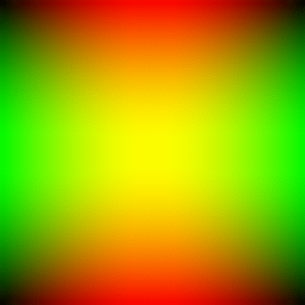

# Hello World

This is my home page! My name is Ben Le and I am a student at [Cal State Fullerton](http://www.fullerton.edu/) and my major is Computer Engineering.

## Computer Science Projects

My GitHub page is [http://github.com/benlenet](http://github.com/benlenet).

### CPSC 120

* Lab 8

    I enjoyed part 1 of lab 8 because it introduced the concept of reading from a file using input streams. I no longer had to rely on manually inputting data into the code or asking for data from the terminal; I could just open a file by specifying its name and opening up an input stream. This new information opened up many possibilities, as I could use the data to determine whether or not the words in the file were palindromes. I really enjoyed the challenge of reversing of the words in my function in order to determine if they were palindromes or not.

* Lab 11

    Lab 11, part 2, was another favorite of mine because it used object-oriented programming to improve a project I had already created. As a result, I learned methods, classes, and objects more easily. Once I finished the lab, I found that the object-oriented version of the Hi-Lo game was much more readable, even if it was harder to code. I enjoyed seeing how the header files and the main file interacted with each other.

* Lab 12

    Lab 12, part 1, was my favorite because I could create a moving image. While I already knew what pixels, RGB, and gifs were, I didn’t know how to put this information together to create an image. However, with the introduction of the Magicks library, I made several images using a gradient before adding them to a vector, creating the visual of a moving image. I am really proud of being able to create this .gif!

## Images

